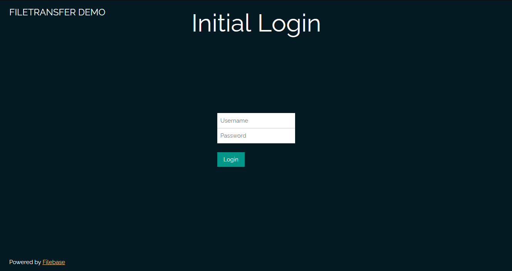
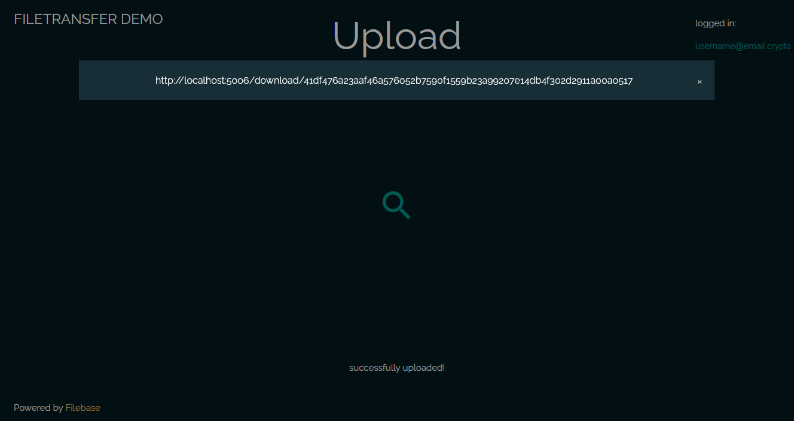
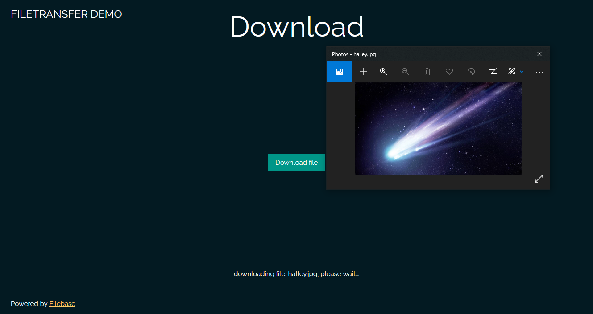

# FileTransfer

A Python/Flask based web application that integrates Filebase.

When running the demo app, a local flask server with a basic client interface will start which can be used to upload and download files to and from Storj, Skynet or Sia (using Filebase). After each upload to Filebase a unique download link is created, stored locally in a mysql database and returned back to the client interface. When using the download link, internally the server fetches the referenced file from Filebase and returns it.

## Used Stack
 -  Server: Python, Flask, MySQL, AWS SDK Boto3
 -  Decentralized Storage: Filebase (Storj, Skynet, Sia)

## Requirements
 -  Docker: https://docs.docker.com/get-docker/
 -  Filebase Access Keys: https://filebase.com/

## Quick Start
Copy and paste the Filebase Access Keys into the `Dockerfile`

### Build and run:
[ Linux ]
```
make all
```
or
```
sudo make all
```
[ Windows ]
```
docker-compose up --build
```
### Once running: 
1. Go to: localhost:port `http://localhost:5006/`
2. Enter your initial username and password



3. Next, upload a file 



4. Finally, copy (or click) the link and download the file or share the link



**NOTE**:  
\
***application***  
 - Currently the initial username and password will be used to login untill the database is removed.
 - If no Filebase Access Keys are provided uploading or downloading is not possible. 
 - This demo is tested with files of around 100MB or smaller. The demo isn't yet optimized for large files, altough it might work depending on your connection speed.
 - If there aren't any buckets on Filebase yet, a default bucket will be created by the app, either using a provided bucketname, see: `Dockerfile`, or a unique name generated by the app. Make sure to provide Access Keys in the `Dockerfile`.
 - Uploading files under the same filename only creates an extra reference link in the server database, not on Filebase.
 - The `transferred/` directory temporarly stores files before deleting them after a successfull transfer.  

***variables***  
 - When changing bucketnames, make sure to use a name between 3 and 63 characters long.
 - When changing ports make sure to set it in `Dockerfile` as well as `docker-compose.yml`.
 - When changing MySQL db/username/password, make sure to update `SQLALCHEMY_DATABASE_URI` in `run.py`.

***general***  
 -  **WARNING**: As mentioned in `Dockerfile`, it's not recommended to create public images and deployments by using the Filebase Access keys inside a Dockerfile, instead modify the code so it can be added to a secured database instance. (During the login process for example)

 **TODO**:
 -  Create a profile and insert Filebase Access Keys via the initial login page instead of hardcoded.
 -  Update profile info feature.
 -  Create a FileTransfer Docker image.
 -  Create a Akash Deployment file to run the app on the dcloud.
 -  Create a `.dockerignore` file.
 -  Old download references stored in the local db seems to restore old deleted bucketnames, fix this.

 **IDEAS**:
 -  Let download links expire after sometime, similar to WeTranswer, by implementing a background worker. (Celery, RabbitMQ)

## Disclaimer

This application is a demo, not a production ready application. Make the nessecary security adjustments before exposing it. If there are any remarks, questions and/or issues regarding this repo feel free to contact me. (see: <code><a href="https://github.com/unameit10000000">profile</a></code>)
